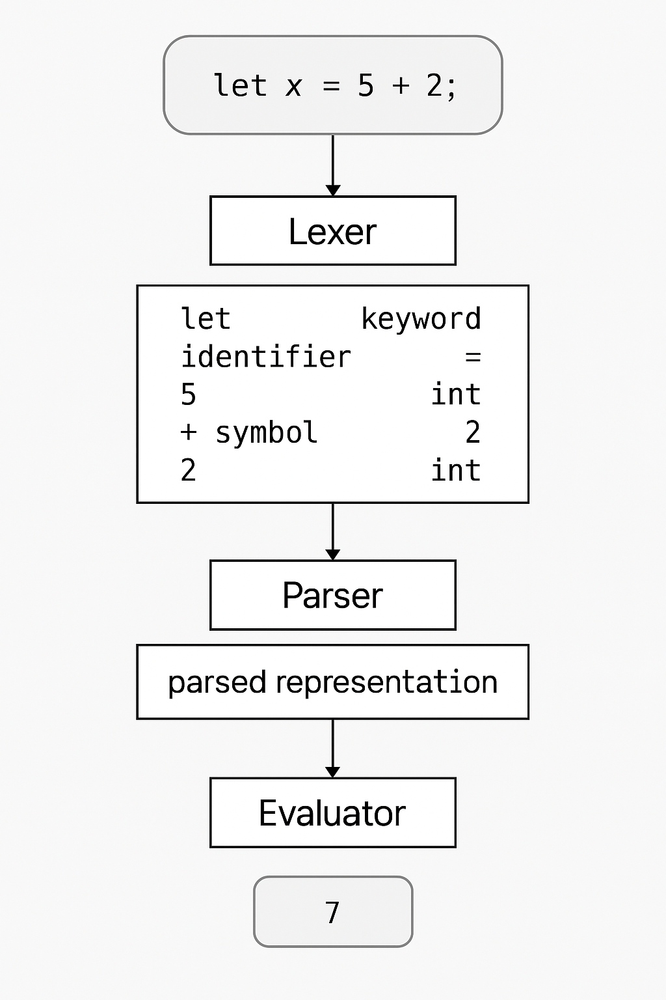

# Interpreter-PL

**Interpreter-PL** is a Java-based interpreter for a custom programming language, designed to execute scripts written in that language. This project serves as both a functional interpreter and an educational resource for understanding interpreter design and implementation.

## Features

- **Custom Language Parsing**: Parses and interprets scripts written in the custom language.
- **Object-Oriented Constructs**: Supports class declarations, inheritance, and method invocations.
- **Control Structures**: Implements loops (`while`, `for`) with support for `break` and `continue` statements.
- **Error Handling**: Provides detailed error messages for syntax and runtime errors.

## Getting Started

### Prerequisites

- **Java Development Kit (JDK)**: Ensure you have JDK 8 or higher installed. [Download JDK](https://www.oracle.com/java/technologies/javase-downloads.html)
- **Apache Maven**: Used for project build and dependency management. [Download Maven](https://maven.apache.org/download.cgi)

### Installation

1. **Clone the Repository**:
   ```bash
   git clone https://github.com/mohamed-shalash/interpreter-pl.git
   cd interpreter-pl
   ```

2. **Build the Project**:
   Use Maven to build the project and resolve dependencies.
   ```bash
   mvn clean install
   ```

3. **Usage**:
After building the project, you can run the interpreter using the following command:
   ```bash
   java -cp target/interpreter-pl-1.0-SNAPSHOT.jar org.example.App
   ```

Once the interpreter is running, you can enter commands or execute script files written in the custom language.


<h3>Examples</h3>
1. Class Declaration and Method Invocation
```kotlin
class Animal {
    let name;
    init(name) { this.name = name; }
    speak() { print(this.name + " makes a sound"); }
};

let dog = new Animal("Dog");
dog.speak();  // Output: Dog makes a sound
```

2. Class Inheritance and Method Overriding
```java
class Animal {
    let name;
    init(name) { this.name = name; }
    speak() { print(this.name + " makes a sound"); }
};

class Dog < Animal {
    speak() { print(this.name + " barks!"); }
};

let myDog = new Dog("Buddy");
myDog.speak();  // Output: Buddy barks!

```
3. Conditional Statements (if-else)
```java
let num = 10;

if (num > 0) {
    print("Positive number");
} else {
    print("Negative number");
}
// Output: Positive number
```

 4.While Loop
```java
let i = 0;
while (i < 5) {
    print(i);
    i = i + 1;
}
// Output: 0 1 2 3 4
```
5. For Loop

```java
for i in range(1, 10, 2) {
    print(i);
}
// Output: 1 3 5 7 9
```


## Project Structure

```text
interpreter-pl/
│── src/
│   ├── main/java/org/example/    # Main source code for the interpreter
│   ├── test/java/org/example/    # Unit tests for interpreter components
│── pom.xml                       # Maven configuration file
│── README.md                     # Project documentation
```


